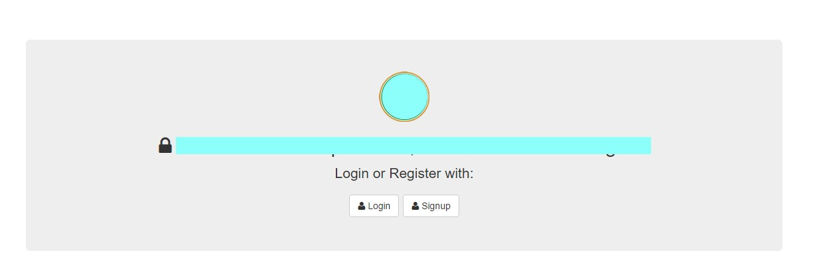
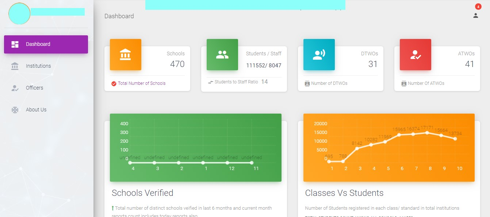
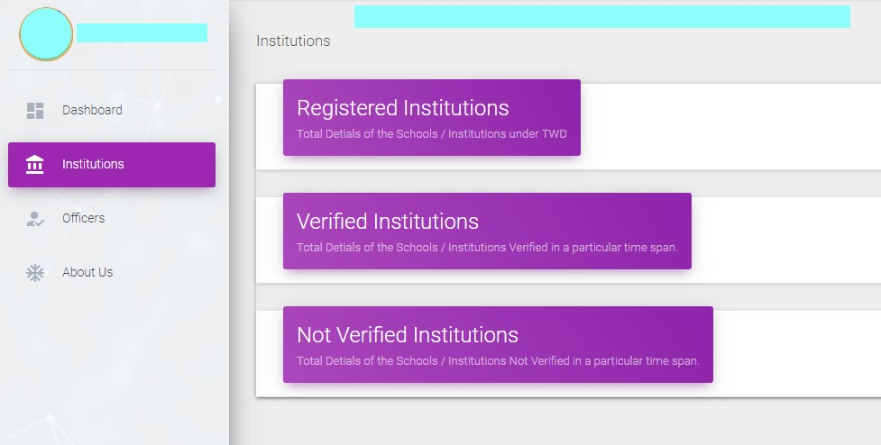
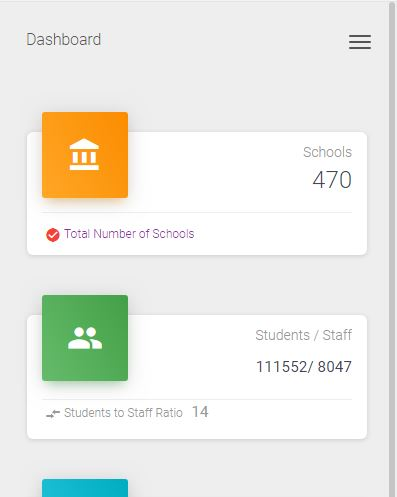

# Tribal Welfare Department, Government of Telangana

This is dashboard developed Using

- NodeJS (Server Setup)
- Passport (Authentication Middleware)
- ExpressJS (Server Framework)
- MySql (Database)
- Javascript (Front End)
- Bootstrap (Front End CSS)
- MaterializeCSS (Front End CSS)

> Due to privacy rules the naming conventions are hidden.

## Instructions

If you would like to download the code and try it for yourself:

1. Clone the repo: `git@github.com:NandaKishorJeripothula/tribalDept-dashboard.git`
1. Install packages: `npm install`
1. Edit the database configuration: `config/database.js`
1. Create the database schema: `node scripts/create_database.js` or use the dashboard_user.sql to create users
1. Launch: `node server.js`
1. Visit in your browser at: `http://localhost:8080`

### The Following are some of the snaps of application

**Landing Page**

**Dashboard Page**

**Institutions Details**

**Mobile View**

Licence: ISC
